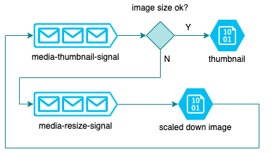

# alejof-thumbnailer

Azure Functions App to generate "smart" thumbnails for uploaded images, using the Azure [Computer Vision API][vision-api].

[vision-api]:https://azure.microsoft.com/en-us/services/cognitive-services/computer-vision/

# Functions

**Thumbnail**: Function that generates "smart" thumbnails for images using the Vision API. It defaults to a 150x150 thumbnail size, and can be overridden in the Application Settings.

**Resize**: Function that scales down images if they are too big. This is because the computer vision api may fail with big images, so this function pre-processes images that are wider or higher than the maximum media size (defaults to 1200px, also overridden by App Settings).

# Processing Flow

The "main" **Thumbnail** function is triggered by a simple string message in a `media-thumbnail-signal` queue, which contains the full path of an image blob in Blob Storage (in the form of `{container}/{blob name}`).

If the image is bigger that the maximum configured size, a new message is put on a `media-resize-signal` and it gets picked up by the **Resize** function, which creates a _new blob_ for the resized image. Next, a new message is put on the thumbnail signal queue (with the new blob's path) to start a new flow.
